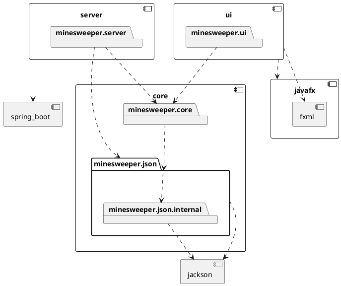
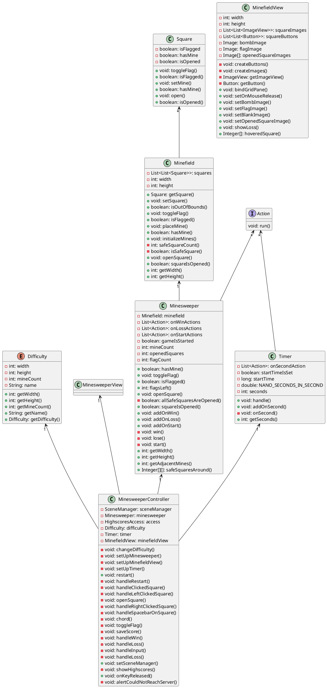

# Minesweeper

Beskrivelse
- 
Minesweeper er et single-player logikkbasert spill. Man spiller på et rutefelt, og målet er å ha trykket på alle rutene uten miner. Hvis man trykker på en mine, taper man. Når man åpner trygge ruter, står det hvor mange miner som ligger rundt den ruta. Hvis det står 8, betyr det at alle rutene rundt inneholder en mine. Hvis det er 0 (vist som en blank rute), er alle rutene rundt trygge. Hvis du mistenker at en rute inneholder en mine, kan du markere den med et flagg. Du får poengsum ut ifra hvor fort du løser brettet.

Poengsummen kan settes på poengtavlen med navnet ditt.

Under finner man et pakkediagram.

Her kan man se et klassediagram som illustrerer de viktigste klassene til et viktig bruksområde.
Klassene under er de som blir brukt mens man spiller Minesweeper-spillet.

Til slutt er det laget et sekvensdiagram som skal illustrere sekvenser ved et vanlig brukstilfelle.

Det kan finnes [her](/docs/sequence-diagram.md)
